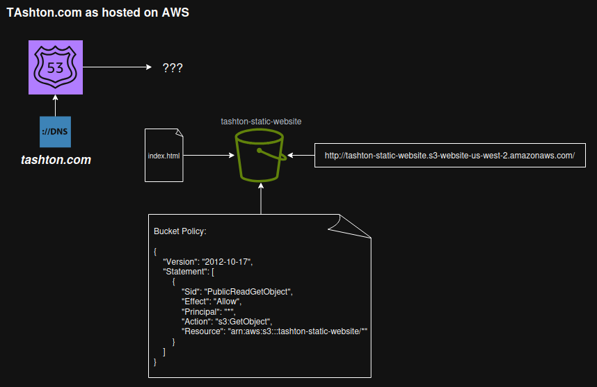

# tashton.com-aws
Code and other assets for tashton.com as hosted on AWS.

## DNS
'tashton.com' has been registered and is managed through AWS's [Route 53](https://aws.amazon.com/route53/).

## Architecture
### v01
Use GitHub Actions to implement some CD/CI.

Set some secrets to use with AWS:
* AWS_ACCESS_KEY_ID
* AWS_SECRET_ACCESS_KEY
* AWS_S3_BUCKET

### v00
Deployment means manually uploading the index.html file to the "tashton-static-website" S3 bucket.

[TAshton.com](http://tashton-static-website.s3-website-us-west-2.amazonaws.com/)

## Directory Structure
### www
* index.html: Simple HTML page, acts as an FPO landing page.
